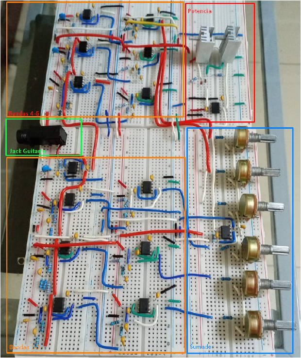

# Ecualizador Analógico de 6 Bandas con Filtros Activos

<p align="center">
  <em>Universidad del Istmo de Guatemala</em><br>
  <em>Facultad de Ingeniería</em><br>
  <em>Ecualizador Analógico de 6 Bandas con Filtros Activos</em><br>
  <em>Integrated Microelectronic Devices</em>
</p>

<div align="center">
  
</div>

<p align="center">
  <em>Maximiliano González</em><br>
  <em>Kevin Gabriel González Donis</em><br>
  <em>2026</em>
</p>

## Descripción del Proyecto

Este repositorio contiene la simulación en LTspice y el informe del proyecto de un ecualizador analógico de 6 bandas diseñado para guitarra eléctrica. El circuito utiliza filtros activos Sallen-Key, una etapa sumadora inversora con control independiente por banda y una etapa de salida push-pull con transistores BJT capaz de excitar una bocina de 8 Ω. El objetivo de este proyecto fue diseñar, simular e implementar físicamente un ecualizador analógico para señales de guitarra eléctrica. El sistema divide la señal de entrada en seis bandas de frecuencia, permite amplificar o atenuar cada banda de forma independiente y luego recombina las señales antes de enviarlas a una etapa de potencia.

El ecualizador está basado en seis filtros pasa-banda de cuarto orden. Cada banda se construye mediante la cascada de:

- un filtro pasa-altas Sallen-Key de segundo orden
- un filtro pasa-bajas Sallen-Key de segundo orden
- una etapa de control de ganancia variable
- una etapa sumadora activa

El proyecto fue validado mediante simulaciones en LTspice, pruebas conceptuales de audio digital, implementación física en protoboard y mediciones de respuesta en frecuencia utilizando un Analog Discovery 3.

## Bandas de Frecuencia

| Banda | Frecuencia Central | Corte Inferior | Corte Superior |
|---:|---:|---:|---:|
| 1 | 63 Hz | 31.5 Hz | 126 Hz |
| 2 | 160 Hz | 80 Hz | 320 Hz |
| 3 | 400 Hz | 200 Hz | 800 Hz |
| 4 | 1 kHz | 500 Hz | 2 kHz |
| 5 | 2.5 kHz | 1.25 kHz | 5 kHz |
| 6 | 6.3 kHz | 3.15 kHz | 12.6 kHz |

Se seleccionó un ancho de banda de dos octavas para cada filtro con el fin de obtener una mejor superposición entre bandas adyacentes y mantener la respuesta máxima cercana a 0 dB antes de la etapa de control de ganancia.

## Características Principales

- Ecualizador analógico de 6 bandas para guitarra eléctrica
- Filtros pasa-banda activos de cuarto orden
- Etapas pasa-altas y pasa-bajas con topología Sallen-Key
- Uso de amplificadores operacionales TL081 con entrada FET
- Control independiente de amplificación y atenuación por banda
- Rango de control aproximado de ±12 dB
- Etapa sumadora activa inversora
- Etapa de potencia con amplificador push-pull complementario BJT
- Diseño orientado a una carga de bocina de 8 Ω
- Simulación realizada en LTspice
- Implementación y prueba física en protoboard

## Arquitectura del Sistema

```text
Entrada de Guitarra Eléctrica
        |
        v
Buffer de Alta Impedancia
        |
        v
Seis Ramas Pasa-Banda en Paralelo
        |
        v
Control de Ganancia por Banda
        |
        v
Sumador Activo Inversor
        |
        v
Etapa de Potencia / Salida
        |
        v
Bocina de 8 Ω
```

## Control de Ganancia

Cada banda utiliza una resistencia de entrada variable hacia el sumador inversor. El diseño emplea:

- Resistencia de realimentación: `Rf = 27 kΩ`
- Resistencia serie mínima: `Rs = 6.8 kΩ`
- Potenciómetro por banda: `P = 100 kΩ`

Con estos valores se obtiene un rango aproximado de control de:

- Máxima amplificación: `+12 dB`
- Ganancia unitaria: `0 dB`
- Máxima atenuación: `-12 dB`

## Simulación en LTspice

El archivo de LTspice incluido contiene la simulación utilizada para validar el comportamiento de los filtros y comparar diferentes opciones de ancho de banda. La simulación incluye las seis bandas diseñadas y un análisis AC. La simulación cubre el rango principal de audio de interés, desde 20 Hz hasta 20 kHz.

## Implementación Física

<div align="center">
  
</div>

El circuito fue implementado en protoboards y probado utilizando:

- Entrada de guitarra eléctrica mediante conector jack de 1/4”
- Analog Discovery 3
- Análisis de respuesta en frecuencia con WaveForms
- Bocina de 8 Ω
- Alimentación simétrica de ±12 V para el circuito de audio
- Disipadores y ventilación adicional para la etapa de potencia

Las mediciones experimentales mostraron que cada banda alcanzó una amplificación aproximada de 11 a 12 dB, cercana al objetivo de diseño de ±12 dB.

## Archivos del Repositorio

| Archivo | Descripción |
|---|---|
| `EQ.asc` | Archivo esquemático de LTspice para la simulación del ecualizador |
| `Microelectrónica___Proyecto_Ecualizador___Kevin_González__Maximiliano_González.pdf` | Informe completo del proyecto con teoría, cálculos, simulaciones, implementación física y mediciones |

## Herramientas Utilizadas

- LTspice
- FL Studio
- Analog Discovery 3
- WaveForms
- Implementacion fisica en protoboard
- Amplificadores operacionales TL081
- Etapa de salida discreta con transistores BJT
